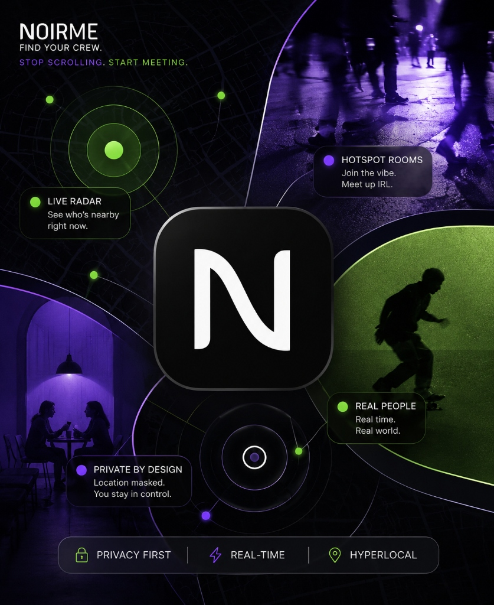
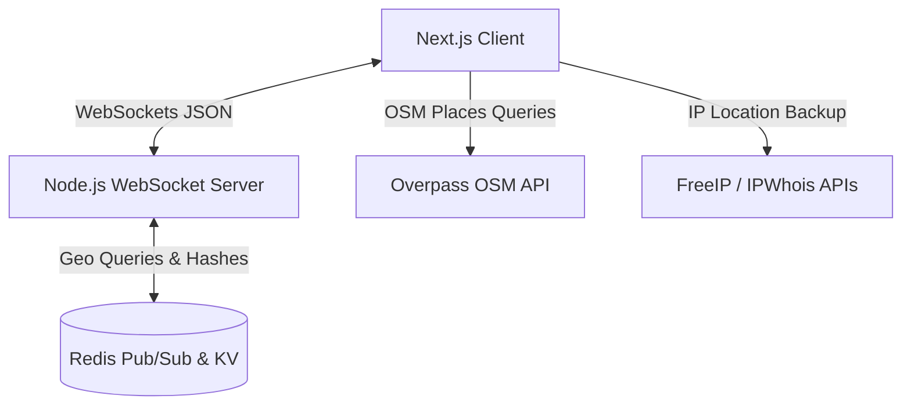

# Norby 🗺️

<p align="center">
  
</p>

> **Stop scrolling. Start meeting. Connect with your neighborhood in real-time.**

Norby is a hyper-local, real-time social discovery platform designed to cure digital isolation and bring neighborhoods together.

---

### ☕ The Core Purpose: Curing Solitude in Real-Time
Imagine you're sitting at home or in a local cafe, wanting to grab a cup of tea or coffee, but none of your friends are free. Or maybe you're new to the area and don't know anyone yet. Instead of endlessly scrolling through social feeds of distant influencers, you open **Norby**.

With one tap, you drop a **Hotspot Room** at your location (e.g., *Tea & Conversation ☕*). Immediately, nearby neighbors see your hotspot on their live map. They request to join, you accept, and within minutes, you're chatting and meeting up in person. 

No matches, no algorithmic feeds, no endless chatting online. Just real people, in real physical proximity, connecting over real-life activities.

---

### 💡 The Pitch
Digital connectivity is at an all-time high, yet human loneliness is a global epidemic. Existing social networks connect us to the *world*, but disconnect us from our *immediate surroundings*. 

**Norby bridges the gap between digital discovery and real-world meeting.**
* **Zero-Friction Interactions**: No profile creation barriers. Generate a secure, anonymous handle in one second and start discovering immediately.
* **Instant Social Broadcast (Hotspots)**: Drop a marker on the map to signal your availability for tea, sports, studying, or jamming.
* **Privacy-Centric Location Masking**: Never broadcasts your exact GPS position; uses stable grid offsets to keep you safe while remaining discoverable.
* **Low-Latency Live Roster**: Optimized WebSocket synchronization keeps the neighborhood map active and dynamic with zero battery drain.

---

## 🏗️ System Architecture

Norby is split into three main parts: an optimized Next.js frontend, a standalone WebSocket coordination server, and a high-performance Redis cache database.



### 1. Frontend: Next.js Client
* **Proximity Radar (`LiveMap.tsx`)**: Integrates React Leaflet for interactive map rendering, custom user indicators, and live hotspot markers.
* **State Manager (`MapProvider.tsx`)**: Governs authentication context, coordinates, notifications, typing indicators, active routes, and active microphone signallers.
* **Geolocation Driver (`useGeolocation.ts`)**: Handles browser GPS tracking, cached coordinates, battery-saver stasis modes, and city-level IP fallbacks.
* **Socket Connector (`useSocket.ts`)**: Manages the persistent WebSocket lifecycle, reconnection backoffs with jitter, offline outbox caching, and event routing.

### 2. Backend: WebSocket Coordinator (`socket-server.ts`)
* **Message Router**: Handles incoming client events, validates schemas using Zod, and routes messages to local connections or Redis Pub/Sub channels.
* **State Synchronizer**: Throttle-controlled sync scheduler sending updates to clients at most once every 3 seconds to prevent client layout lagging and Redis hammering.
* **Background Maintenance**: Runs asynchronous cleanup routines off the client critical path to keep Redis memory footprint minimal.

### 3. Database: Redis Cache Layer
* **Geo-spatial Indices (`norby:user_locations`)**: A Redis Sorted Set managing active coordinates. Allows instant city-wide geo-queries.
* **Roster Hashes (`norby:active_users`)**: Stores serialized JSON payloads containing active user handles, vibes, avatars, tags, and heartbeat timestamps.
* **Hotspot Spaces (`norby:hotspots`)**: Tracks open meetups, join requests, accepted guest IDs, and transient message histories.

---

## ⚡ Core Protocols & Algorithms

### 1. Geolocation Racing & Stable Offset Masking
To prevent the map from collapsing on launch and protect user privacy:
1. **Racing Mode**: On mount, the client calls `getIPLocation()` and `navigator.geolocation.getCurrentPosition()` simultaneously. The first to resolve sets the map center, ensuring a <200ms initial render.
2. **Stable Grid Masking**: User locations are masked using a deterministic grid offset algorithm:
   ```typescript
   const gridScale = 0.0045; // ~500m grid cell boundaries
   const cellLat = Math.floor(actualLat / gridScale);
   const cellLng = Math.floor(actualLng / gridScale);
   const seed = (cellLat * 73856093) ^ (cellLng * 19349663);
   const offset = (Math.abs(Math.sin(seed) * 1000) % 1) - 0.5;
   ```
   This ensures the coordinate offset remains identical while the user is stationary within their neighborhood grid, preventing marker jittering, but keeps their exact street address hidden.

### 2. Battery-Saver GPS Stasis Loop
To prevent mobile device battery drainage from continuous GPS tracking:
* If the user's GPS coordinates shift by less than 3 meters for 3 minutes, the client clears the high-power GPS watch interval and switches to a low-power passive poll (running every 2 minutes).
* **Wakeup Trigger**: The second a click, touch, map pan, or movement (>5m) is detected, the app wakes up and instantly restores the high-power active GPS watch.

### 3. Ultra-Fast WebSocket Sync (0.5ms latency)
* Client location updates and radar fetches are combined into a single roundtrip.
* Instead of running database existence pipelines per user during active sync, the server executes a single batch `hmGet` query for all nearby IDs.
* Disconnected or idle users are filtered in-memory:
  ```typescript
  const isAlive = Date.now() - (user.last_seen || 0) <= 45000; // 45s cutoff
  ```

### 4. Background Sweeper (Zombie Cleanup)
* Instead of database pruning on client-facing threads, a background worker runs every **30 seconds** on the server.
* It checks the `last_seen` timestamp of all active user records and purges expired entries asynchronously using a Redis pipeline (`zRem`, `hDel`).

### 5. Input Sanitization & XSS Prevention
* All public inputs (chat messages, custom bios, hotspot names) are automatically HTML-entity encoded before storage and rendering to prevent Cross-Site Scripting (XSS) attacks:
  ```typescript
  function sanitizeInput(input: string): string {
    return input
      .replace(/&/g, "&amp;")
      .replace(/</g, "&lt;")
      .replace(/>/g, "&gt;")
      .replace(/"/g, "&quot;")
      .replace(/'/g, "&#x27;")
      .replace(/\//g, "&#x2F;");
  }
  ```

---

## 📡 WebSocket Protocol Reference

### Client-to-Server Payloads
All payloads are Zod-validated JSON strings with a matching `type` parameter:

* `location_update`: Sent every 30s or on pan/move to broadcast presence.
  ```json
  {
    "type": "location_update",
    "user_id": "user_123",
    "username": "NeonNomad",
    "lat": 28.6139,
    "lng": 77.209,
    "bio": "Jamming alt records",
    "radarRange": 15
  }
  ```
* `create_hotspot`: Spawn a new local social room.
  ```json
  {
    "type": "create_hotspot",
    "user_id": "user_123",
    "username": "NeonNomad",
    "title": "Matcha Coffee Grind",
    "lat": 28.6139,
    "lng": 77.209,
    "hotspotRange": 15
  }
  ```
* `send_direct_message`: Ephemeral direct messaging.
  ```json
  {
    "type": "send_direct_message",
    "recipient_id": "target_user_456",
    "text": "Heading to the cafe!"
  }
  ```

---

## 🚀 Getting Started

### 1. Setup Local Environment
Clone the repository, install packages, and initialize variables:
```bash
git clone https://github.com/gitsofaryan/norby.git
cd norby
npm install
```

Create a `.env.local` in the root:
```env
NEXT_PUBLIC_WS_URL=ws://localhost:3001
```

### 2. Verify Local Changes
Before opening a pull request, run the same local verification commands referenced in the contributor guide:
```bash
npm run verify
```

This runs TypeScript checking followed by a production build so contributors can catch compile-time or Next.js build issues before review.

### 3. Launch Dev Servers
Start the Next.js app and the WebSocket server simultaneously:
```bash
npm run dev
```

* **Frontend App**: [http://localhost:3000](http://localhost:3000)
* **WebSocket Port**: `http://localhost:3001`

---

## 🤝 Contributing & Bounty Program

We welcome contributions from the community! Whether you are fixing bugs, developing features, or updating documentation, we want your help to make Norby even better.

> [!TIP]
> ### 🎁 Get Rewarded for Your Work
> **Meaningful contributions will be rewarded up to ₹250!**
> Pull requests that provide high-value enhancements (such as bug fixes, performance improvements, doc clarity, or new features) are eligible for bounty payouts. Only clean, meaningful contributions will be counted.

For details on coding guidelines, branch naming conventions, and checklist criteria, see our [Contributor Guide](CONTRIBUTING.md).

